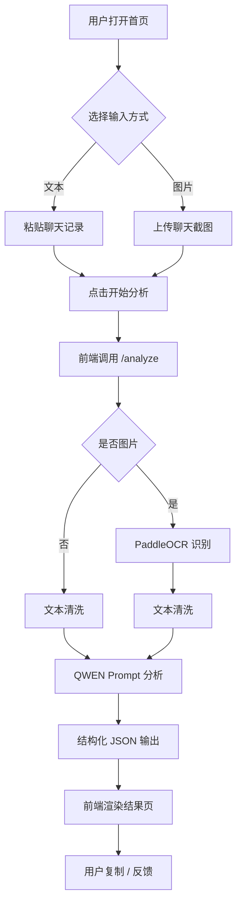

# AI 社恐聊天外挂 — 产品需求文档（PRD）

> 文档版本：v1.0  
> 更新日期：2026-06-16  
> 当前迭代：W1（OCR + Prompt 联调，本地端到端跑通）

---

## 1. 产品概述

**产品名称**：AI 社恐聊天外挂（AI Conversation Coach）  
**Slogan**：不止替你回，更教你如何回。

本产品是基于大模型的"对话教练"，帮助社恐、恋爱/职场沟通困难的用户理解对方意图、识别聊天风险，并提供带"教学价值"的多风格回复建议。它不替用户撒谎，而是帮助用户提升表达能力。

- **目标用户**：社恐人群、恋爱/职场聊天困难者、表达能力弱人群
- **产品形态**：Web 应用（响应式，桌面 + 移动端）
- **MVP 时间**：3~4 周
- **W1 范围**：OCR + Prompt 联调，本地端到端跑通

---

## 2. 核心功能

### 2.1 用户角色
MVP 阶段不区分角色，匿名使用即可。

| 角色 | 入口 | 核心权限 |
|---|---|---|
| 匿名用户 | 无需登录 | 上传/粘贴聊天记录、查看分析、复制回复 |

### 2.2 功能模块
1. **首页（/）**：输入聊天记录（图片/文本）、开始分析
2. **结果页（/result/:id）**：聊天分析报告、推荐回复、聊天体检报告、本轮总结
3. **历史记录（/history）**：本地缓存最近 20 次分析（IndexedDB）

### 2.3 页面详情

| 页面 | 模块 | 功能描述 |
|---|---|---|
| 首页 | 输入区 | 支持图片上传（PNG/JPG/WebP，≤10MB，最多 5 张）和文本粘贴 |
| 首页 | 示例数据 | 一键填充示例聊天记录 |
| 首页 | 操作按钮 | "开始分析" → 跳转结果页 |
| 结果页 | 关系/阶段/情绪/风险 | 顶部 4 个标签，2×2 折叠面板 |
| 结果页 | 推荐回复 | 5 种风格 tab：high_eq / humor / formal / flirty / concise |
| 结果页 | 体检报告 | 自然度 / 互动度 / 冷场风险 / 回复质量 4 项 + 建议 |
| 结果页 | 总结 | 一句话总结当前聊天状态 |
| 结果页 | 复制按钮 | 单条复制 + 一键复制全部 |
| 结果页 | 反馈 | 👍 / 👎 反馈按钮 |
| 历史 | 列表 | 时间倒序，最多 20 条，点击回看 |

### 2.4 W1 子任务清单
- [x] 创建 PRD 文档
- [x] 创建技术架构文档
- [ ] 初始化前端项目（Vue 3 + Vite + Tailwind）
- [ ] 初始化后端项目（FastAPI + Uvicorn）
- [ ] 接入 PaddleOCR（图片 → 文本）
- [ ] 接入 QWEN（Prompt → JSON 输出）
- [ ] 打通 `/analyze/text` 与 `/analyze/image` 接口
- [ ] 最小化前端：输入 → 加载 → 结果展示
- [ ] 本地端到端测试通过

---

## 3. 核心流程

### 3.1 用户主流程（文本输入）
```
用户打开首页
  → 在文本框粘贴聊天记录
  → 点击"开始分析"
  → 前端调用 POST /analyze/text
  → 后端调用 QWEN，结构化分析
  → 返回 JSON：关系/阶段/情绪/风险/回复/体检/总结
  → 跳转结果页，渲染所有内容
  → 用户复制回复 / 反馈
```

### 3.2 用户主流程（图片输入）
```
用户打开首页
  → 上传 1~5 张微信聊天截图
  → 点击"开始分析"
  → 前端调用 POST /analyze/image（multipart）
  → 后端：
      1. 保存图片到临时目录
      2. PaddleOCR 识别图片文字
      3. 文本清洗为统一格式
      4. QWEN 综合分析
  → 返回 JSON（同上）
  → 跳转结果页
```

### 3.3 流程图



---

## 4. 用户界面设计

### 4.1 设计风格
- **整体调性**：现代化、简洁、科技感
- **主色**：`#0EA5E9`（晴空蓝，强调行动）
- **辅色**：`#A78BFA`（薰衣草紫，情绪与情感）
- **中性色**：`zinc` 系（zinc-50 ~ zinc-900）
- **风险色**：`#F43F5E`（玫红，警示）
- **正文字体**：`Inter`（界面）+ `JetBrains Mono`（代码/标签）
- **标题字体**：`Sora`（圆润且有科技感）
- **圆角**：12px 卡片 / 8px 按钮
- **阴影**：`shadow-lg shadow-zinc-900/5`（浅）/ `shadow-2xl shadow-zinc-950/40`（深色模式）
- **动效**：加载时骨架屏 + 呼吸光晕；结果出现时 staggered fade-in

### 4.2 页面设计概览

| 页面 | 模块 | UI 元素 |
|---|---|---|
| 首页 | Hero | 渐变背景 + Sora 大标题 + 副标题 |
| 首页 | 上传区 | 双 tab（图片/文本），圆角 16px，hover 抬升 |
| 首页 | CTA | 主色按钮，hover 微光 |
| 结果页 | 顶部状态条 | 4 个 pill 标签，圆角胶囊 |
| 结果页 | 回复卡片 | 5 个 tab + 单卡片，hover 阴影加深 |
| 结果页 | 体检报告 | 4 条水平进度条 + 颜色梯度 |
| 全局 | 主题切换 | 右上角太阳/月亮图标，CSS 变量切换 |

### 4.3 深色模式
- 默认跟随系统
- 手动切换持久化到 localStorage
- 所有颜色使用 CSS 变量，便于主题切换

### 4.4 响应式
- 桌面优先（≥1024px）
- 平板（768~1024px）：左右内边距缩小
- 移动端（<768px）：单列布局，按钮全宽

---

## 5. 数据模型（MVP 简化版）

### 5.1 AnalysisRecord
| 字段 | 类型 | 说明 |
|---|---|---|
| id | string | UUID |
| created_at | datetime | 创建时间 |
| input_type | enum | "text" / "image" |
| raw_text | string | 原始文本（脱敏后） |
| result | object | 分析结果 JSON |
| feedback | object \| null | 用户反馈 |

### 5.2 AnalysisResult
| 字段 | 类型 | 说明 |
|---|---|---|
| relationship | object | `{label, confidence, evidence}` |
| stage | string | 破冰/热聊/平稳/冷场/收尾 |
| emotion | object | `{label, score}` |
| risk | array | `[{type, level, evidence}]` |
| replies | array | `[{style, content, reason, expected_reply}]` |
| health_report | object | `{naturalness, engagement, silence_risk, reply_quality}` |
| summary | string | 一句话总结 |
| advice | array | 改进建议 |

MVP 阶段，**数据存储使用前端 IndexedDB**，后端不持久化原始内容（隐私第一）。

---

## 6. 验收标准（W1）

| 指标 | 目标 |
|---|---|
| 文本分析端到端耗时 | ≤ 4s |
| 图片分析端到端耗时 | ≤ 8s |
| QWEN 输出 JSON 解析成功率 | ≥ 95% |
| OCR 字段识别准确率 | ≥ 90%（微信截图场景） |
| 本地启动命令 ≤ 3 步 | `cd backend && uvicorn ...`<br>`cd frontend && pnpm dev` |

---

## 7. 风险与对策

| 风险 | 对策 |
|---|---|
| QWEN 输出 JSON 格式不稳定 | Prompt 强制 JSON + 后端正则兜底 + 失败重试 1 次 |
| OCR 识别率低 | 多图上传 + 文本框兜底（用户可手动修正） |
| 隐私顾虑 | 强调"不留存"，后端不写库，临时文件 1h TTL |
| QWEN API Key 泄露 | `.env` 文件加入 `.gitignore`，提供 `.env.example` |
| PaddleOCR 模型加载慢 | 后端启动时预加载，第二次请求无加载耗时 |
