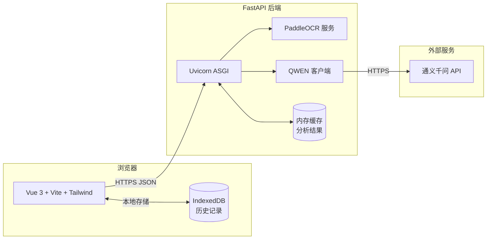
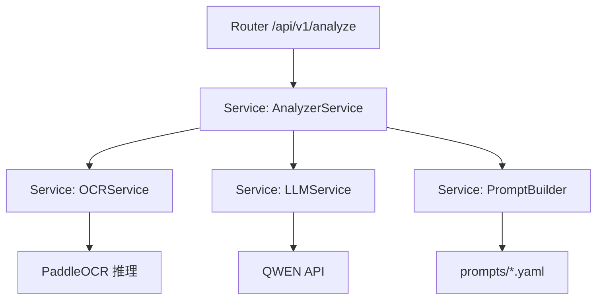

# AI 社恐聊天外挂 — 技术架构文档

> 文档版本：v1.0  
> 更新日期：2026-06-16  
> 当前迭代：W1（OCR + Prompt 联调）

---

## 1. 架构设计

### 1.1 总体架构



### 1.2 W1 精简架构（本期目标）

W1 阶段**不引入数据库、不引入 Redis**，只打通最小可用链路：

```
浏览器 (Vue 3)
    │
    │ POST /analyze/text | /analyze/image
    ▼
FastAPI (Uvicorn :8000)
    │
    ├─ /analyze/image → PaddleOCR → 文本
    │
    └─ → QWEN API (Prompt) → JSON
    │
    ▼
返回结构化结果给前端
```

---

## 2. 技术选型

### 2.1 前端
- **框架**：Vue 3（Composition API + `<script setup>`）
- **构建**：Vite 5
- **样式**：Tailwind CSS 3
- **路由**：Vue Router 4
- **状态**：Pinia
- **HTTP**：Axios
- **图标**：lucide-vue-next
- **存储**：IndexedDB（通过 `idb-keyval`）

### 2.2 后端
- **框架**：FastAPI 0.115+
- **ASGI**：Uvicorn
- **OCR**：PaddleOCR 2.7+（CPU 推理）
- **LLM SDK**：openai（兼容 QWEN 模式）或 dashscope
- **数据验证**：Pydantic v2
- **日志**：loguru
- **配置**：pydantic-settings
- **图片处理**：Pillow

### 2.3 外部服务
- **QWEN**：qwen-plus 模型（性价比高）
- **PaddleOCR**：自部署，CPU 即可跑

---

## 3. 路由定义

| 路由 | 文件 | 用途 |
|---|---|---|
| `/` | `src/views/HomeView.vue` | 首页，输入聊天记录 |
| `/result/:id` | `src/views/ResultView.vue` | 结果页，展示分析 |
| `/history` | `src/views/HistoryView.vue` | 历史记录（IndexedDB） |
| `/api/analyze/text` | `app/api/v1/analyze.py` | 文本分析 |
| `/api/analyze/image` | `app/api/v1/analyze.py` | 图片分析 |
| `/api/feedback` | `app/api/v1/feedback.py` | 用户反馈（仅日志） |
| `/api/healthz` | `app/api/v1/health.py` | 健康检查 |

---

## 4. API 定义

### 4.1 POST `/api/analyze/text`

**请求**
```json
{
  "raw_text": "[2026-06-15 10:23] 我: 在吗\n[2026-06-15 10:24] 她: 嗯嗯 怎么了",
  "user_role": "我",
  "extra_context": "刚认识 2 周的同事"
}
```

**响应**
```json
{
  "code": 0,
  "msg": "ok",
  "data": {
    "analysis_id": "uuid",
    "input_type": "text",
    "messages": [
      { "time": "2026-06-15 10:23", "sender": "我", "content": "在吗" },
      { "time": "2026-06-15 10:24", "sender": "她", "content": "嗯嗯 怎么了" }
    ],
    "relationship": { "label": "同事", "confidence": 0.86, "evidence": "..." },
    "stage": "破冰",
    "emotion": { "label": "礼貌", "score": 0.72 },
    "risk": [
      { "type": "single_side_initiative", "level": "low", "evidence": "..." }
    ],
    "replies": [
      {
        "style": "high_eq",
        "content": "刚看到一份挺有意思的报告，想跟你聊聊~",
        "reason": "用'挺有意思'降低压力，用'~'增加亲和度",
        "expected_reply": ["愿意听", "好奇追问"]
      }
    ],
    "health_report": {
      "naturalness": 78,
      "engagement": 65,
      "silence_risk": 35,
      "reply_quality": 70
    },
    "summary": "目前处于破冰阶段，对方态度礼貌中性，可尝试开放式话题。",
    "advice": ["可以多问开放式问题", "适当分享自己的状态"]
  },
  "request_id": "..."
}
```

### 4.2 POST `/api/analyze/image`

**请求**：`multipart/form-data`，字段 `images`（1~5 个文件）

**响应**：同 4.1，`input_type` 为 `image`，并额外包含 `ocr_text` 字段。

### 4.3 错误码
| code | 含义 |
|---|---|
| 0 | 成功 |
| 1001 | 参数错误 |
| 1002 | 图片过大 / 格式不支持 |
| 2001 | OCR 失败 |
| 2002 | LLM 调用失败 |
| 2003 | 内容安全拦截 |
| 5000 | 服务器内部错误 |

---

## 5. 服务端架构

### 5.1 分层



### 5.2 关键模块

| 模块 | 路径 | 职责 |
|---|---|---|
| `analyze.py` | `app/api/v1/` | 路由处理 |
| `analyzer.py` | `app/services/` | 业务编排 |
| `ocr_service.py` | `app/services/` | 封装 PaddleOCR |
| `llm_service.py` | `app/services/` | 封装 QWEN 调用 + JSON 解析 |
| `prompt_builder.py` | `app/services/` | 模板渲染 |
| `prompts/` | `app/prompts/` | Prompt 模板（YAML） |
| `schemas.py` | `app/models/` | Pydantic 模型 |

---

## 6. 数据模型

W1 阶段无数据库，但定义 Pydantic 模型作为契约。

### 6.1 Message
```python
class Message(BaseModel):
    time: str
    sender: str
    content: str
```

### 6.2 Reply
```python
class Reply(BaseModel):
    style: Literal["high_eq", "humor", "formal", "flirty", "concise"]
    content: str
    reason: str
    expected_reply: list[str]
```

### 6.3 HealthReport
```python
class HealthReport(BaseModel):
    naturalness: int  # 0~100
    engagement: int
    silence_risk: int
    reply_quality: int
```

### 6.4 AnalysisResult
```python
class AnalysisResult(BaseModel):
    analysis_id: str
    input_type: Literal["text", "image"]
    messages: list[Message]
    relationship: Relationship
    stage: str
    emotion: Emotion
    risk: list[Risk]
    replies: list[Reply]
    health_report: HealthReport
    summary: str
    advice: list[str]
    ocr_text: str | None = None
```

---

## 7. 目录结构

```
g:\AI聊天助手\
├── .trae/
│   └── documents/
│       ├── PRD.md                # 产品需求文档
│       └── TECH.md               # 技术架构文档（本文）
│
├── frontend/                     # Vue 3 前端
│   ├── src/
│   │   ├── api/
│   │   │   └── client.ts         # axios 封装
│   │   ├── components/
│   │   │   ├── Uploader.vue      # 输入组件
│   │   │   ├── ReplyCard.vue     # 回复卡片
│   │   │   ├── HealthRadar.vue   # 体检报告
│   │   │   └── Tag.vue           # 标签
│   │   ├── views/
│   │   │   ├── HomeView.vue
│   │   │   ├── ResultView.vue
│   │   │   └── HistoryView.vue
│   │   ├── stores/
│   │   │   └── history.ts        # Pinia
│   │   ├── router/
│   │   │   └── index.ts
│   │   ├── utils/
│   │   │   ├── format.ts
│   │   │   └── idb.ts            # IndexedDB 封装
│   │   ├── App.vue
│   │   ├── main.ts
│   │   └── style.css             # Tailwind 入口
│   ├── index.html
│   ├── package.json
│   ├── tsconfig.json
│   ├── vite.config.ts
│   ├── tailwind.config.js
│   ├── postcss.config.js
│   └── .env.example
│
├── backend/                      # FastAPI 后端
│   ├── app/
│   │   ├── api/
│   │   │   └── v1/
│   │   │       ├── analyze.py
│   │   │       ├── feedback.py
│   │   │       └── health.py
│   │   ├── core/
│   │   │   ├── config.py         # 配置
│   │   │   └── logger.py         # 日志
│   │   ├── services/
│   │   │   ├── analyzer.py       # 业务编排
│   │   │   ├── ocr_service.py    # OCR 封装
│   │   │   ├── llm_service.py    # LLM 封装
│   │   │   └── prompt_builder.py # Prompt 渲染
│   │   ├── prompts/
│   │   │   ├── analyze.yaml
│   │   │   └── reply.yaml
│   │   ├── models/
│   │   │   └── schemas.py
│   │   └── main.py
│   ├── tests/
│   │   ├── test_analyze_text.py
│   │   └── test_analyze_image.py
│   ├── requirements.txt
│   ├── run.sh                    # 一键启动脚本
│   └── .env.example
│
└── README.md
```

---

## 8. 启动与运行

### 8.1 后端
```bash
cd backend
python -m venv .venv
.venv\Scripts\activate
pip install -r requirements.txt
# 安装 PaddleOCR
pip install paddlepaddle paddleocr
# 配置 .env
cp .env.example .env
# 填入 QWEN_API_KEY
uvicorn app.main:app --reload --port 8000
```

### 8.2 前端
```bash
cd frontend
pnpm install   # 或 npm install
cp .env.example .env
pnpm dev       # 默认 :5173
```

### 8.3 端到端验证
```bash
curl -X POST http://localhost:8000/api/analyze/text \
  -H "Content-Type: application/json" \
  -d '{"raw_text":"[10:00] 我: 在吗\n[10:01] 她: 嗯"}'
```

---

## 9. 关键技术细节

### 9.1 PaddleOCR 集成
- 使用 `PaddleOCR(use_angle_cls=True, lang="ch")` 初始化
- 启动时单例化，避免每次请求重新加载
- 微信截图多为竖屏多行聊天气泡，预处理：先灰度化 → 自适应二值化 → 按行切分
- 多张图片：分别识别后用时间戳对齐

### 9.2 QWEN Prompt 策略
- **System Prompt**：固定，定义角色 + 输出 JSON 格式
- **User Prompt**：动态拼装 = 模板 + 聊天记录
- **响应解析**：先 `json.loads`，失败时正则提取 `{}` 块，再失败则重试 1 次
- **温度**：0.7（兼顾稳定与自然）

### 9.3 JSON 兜底解析
```python
def parse_json_safely(text: str) -> dict:
    try:
        return json.loads(text)
    except json.JSONDecodeError:
        match = re.search(r"\{[\s\S]*\}", text)
        if match:
            return json.loads(match.group(0))
        raise ValueError("无法解析 JSON")
```

### 9.4 CORS
开发环境允许 `http://localhost:5173`；生产环境收窄为正式域名。

### 9.5 性能优化
- OCR 结果加 LRU 缓存（key = 文件 hash）
- QWEN 调用加超时（30s）和重试（最多 1 次）
- 前端：分析请求加防抖，避免重复点击

---

## 10. 安全与隐私

- 上传图片仅临时存储 1 小时，到期自动清理
- 后端不写数据库（仅日志 + 内存缓存）
- `.env` 不入版本控制
- 敏感词过滤：调用 QWEN 的 `safe_mode` 开启
- 日志脱敏：聊天内容不打印明文，只打印 hash 与长度

---

## 11. W1 里程碑清单

| # | 任务 | 状态 |
|---|---|---|
| 1 | 创建 PRD & 技术架构文档 | ✅ 进行中 |
| 2 | 初始化前端 Vue 3 + Vite + Tailwind | ⏳ |
| 3 | 实现首页 UI | ⏳ |
| 4 | 初始化后端 FastAPI | ⏳ |
| 5 | 接入 PaddleOCR | ⏳ |
| 6 | 接入 QWEN + Prompt 模板 | ⏳ |
| 7 | 实现 `/analyze/text` | ⏳ |
| 8 | 实现 `/analyze/image` | ⏳ |
| 9 | 前端调用 + 结果页骨架 | ⏳ |
| 10 | 本地端到端测试 | ⏳ |
