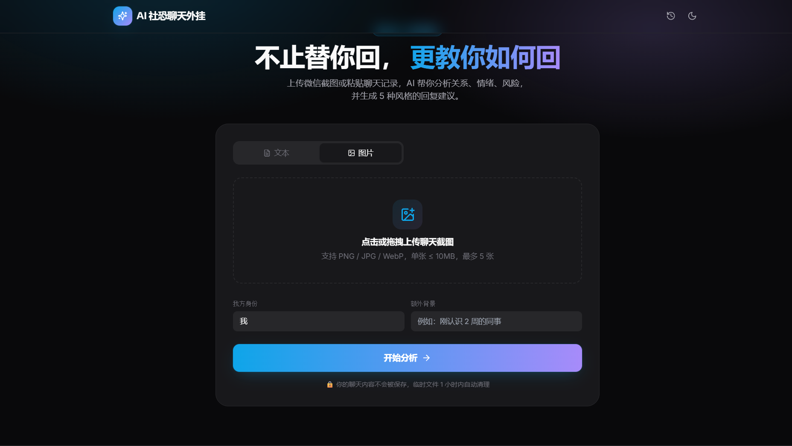
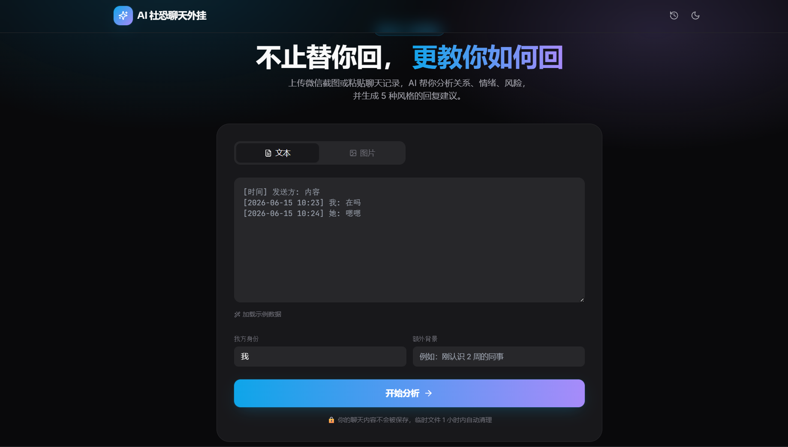

# AI 社恐聊天外挂

> **不止替你回，更教你如何回。**
> AI 驱动的"对话教练"，帮社恐、恋爱/职场沟通困难的用户读懂对方、识别风险、学会回复。

[]() []() []() []() []() []()

[项目简介](#-项目简介) · [功能特性](#-功能特性) · [产品截图](#-产品截图) · [技术架构](#-技术架构) · [快速开始](#-快速开始) · [项目结构](#-项目结构) · [测试](#-测试) · [API 文档](#-api-文档) · [环境配置](#-环境配置) · [开发路线](#-开发路线) · [贡献指南](#-贡献指南) · [许可证](#-许可证)

---

## 📌 项目简介

**AI 社恐聊天外挂** 是一款基于大模型的"对话教练"产品。它不替用户撒谎，而是帮助用户：

- 🧠 **读懂对方**：自动识别聊天记录中的关系（同事/朋友/对象/家长）、阶段（破冰/热聊/平稳/冷场/收尾）、情绪、风险（敷衍/敏感词/话题已死）
- 💎 **学会怎么回**：生成 5 种风格的回复建议（**高情商 / 幽默 / 正式 / 暧昧 / 简洁**），每条都附带「为什么这么回」和「对方可能怎么接」
- 📊 **复盘自己**：聊天体检报告 — 自然度 / 互动度 / 冷场风险 / 回复质量 四项指标
- 📝 **一句话总结**当前聊天状态 + 可执行建议
- 👍 / 👎 反馈闭环，让推荐越用越准

支持 **文本粘贴** 和 **图片上传**（自动 OCR 识别聊天截图），OCR 和 LLM 都做了 **mock 降级**，离线也能跑通完整流程。

---

## ✨ 功能特性

| 模块 | 能力 |
|---|---|
| 📝 **文本分析** | 粘贴聊天记录 → 6 大维度分析 + 5 风格回复 + 体检报告 |
| 📷 **图片识别** | 上传 1-5 张微信截图 → OCR 识别 → LLM 分析 |
| 🎯 **5 风格回复** | 高情商 / 幽默 / 正式 / 暧昧 / 简洁，每条带理由 |
| 📊 **聊天体检** | 自然度 / 互动度 / 冷场风险 / 回复质量 4 维打分 |
| ⚠️ **风险预警** | 单方主动、回复敷衍、话题已死、敏感词、不建议继续 |
| 💾 **本地历史** | 浏览器 IndexedDB 缓存最近 20 次分析记录 |
| 🌗 **主题切换** | 浅色 / 深色 / 跟随系统 |
| 📱 **响应式** | 桌面 + 移动端自适应 |
| 🔄 **反馈学习** | 👍/👎 反馈 + 文字评论，用于后续优化 |
| 🛡️ **优雅降级** | 无 API Key 走 Mock，无 OCR 引擎走 Mock，流程不中断 |

---

## 📸 产品截图

| 首页 | 分析结果 |
|---|---|
|  |  |

> 截图来自真实运行效果，分别展示首页上传界面和分析结果页。

---

## 🏗️ 技术架构

```
┌──────────────────────────────────────────────────────────────┐
│                     浏览器 (Vue 3)                            │
│   ┌─────────────┐  ┌──────────────┐  ┌──────────────────┐    │
│   │ HomeView    │  │ ResultView   │  │ HistoryView      │    │
│   │ (上传/粘贴) │→ │ (分析结果)   │  │ (历史记录)       │    │
│   └──────┬──────┘  └──────▲───────┘  └──────────────────┘    │
│          │  POST /api/analyze/{text,image}                    │
│          ▼                                                    │
│   Pinia + Axios + Tailwind + Lucide                          │
│   IndexedDB (idb-keyval)  ← 历史记录持久化                   │
└──────────────────────────┬───────────────────────────────────┘
                           │ HTTP/JSON
                           ▼
┌──────────────────────────────────────────────────────────────┐
│                   FastAPI 后端 (端口 8000)                    │
│   analyze.py  →  ocr_service.py  →  RapidOCR (ONNX)          │
│        │                  ↓                                  │
│        └──→  llm_service.py  →  QWEN (OpenAI 兼容)            │
│                       ↓                                      │
│              prompt_builder.py (YAML + string.Template)      │
│                       ↓                                      │
│              analyzer.py (业务编排)                           │
└──────────────────────────────────────────────────────────────┘
                           │
                           ▼
                  通义千问 API (HTTPS)
```

**设计原则**

- ✅ **优雅降级** — 无 API Key → Mock JSON · 无 OCR 引擎 → Mock 文本 · 流程始终可走通
- ✅ **无状态后端** — 不引入数据库 / Redis；客户端在 IndexedDB 缓存历史
- ✅ **类型安全** — 后端 Pydantic v2，前端 TypeScript 严格模式
- ✅ **测试驱动** — 88 个自动化测试（49 后端 + 39 前端）全部通过

---

## 🛠️ 技术栈

| 层级 | 技术 | 选型理由 |
|---|---|---|
| **前端** | Vue 3.5 + Vite 5 | Composition API + 极速 HMR |
| | TypeScript 5.6 | 严格类型检查 |
| | Tailwind CSS 3 | 实用类优先，构建产物小 |
| | Pinia 2 | 轻量级状态管理 |
| | Vue Router 4 | History 模式路由 |
| | Axios | 拦截器自动解包 `code: 0` 响应 |
| | idb-keyval | Promise 友好的 IndexedDB 封装 |
| | lucide-vue-next | Tree-shakable 图标库 |
| | Vitest 1.6 + happy-dom | 快速单元测试 |
| **后端** | FastAPI 0.115 | 异步、自动生成 OpenAPI |
| | Pydantic v2 | 类型安全的数据模型 |
| | Uvicorn | ASGI 高性能服务器 |
| | loguru | 美观易用的日志库 |
| | PyYAML + string.Template | Prompt 模板渲染 |
| | RapidOCR (ONNX) | 轻量中文 OCR 引擎 |
| | openai SDK | 兼容 QWEN 的 OpenAI 协议 |
| | pytest 8.3 | 单元测试 + API 测试 |

---

## 🚀 快速开始

### 环境要求

- **Python** 3.10+（已在 3.12 测试）
- **Node.js** 18+（已在 20 测试）
- **Git**

### 1. 克隆仓库

```bash
git clone https://github.com/baishi12121/AI-.git
cd AI-
```

### 2. 启动后端（端口 8000）

```bash
cd backend

# 创建虚拟环境
python -m venv .venv
# Windows:
.\.venv\Scripts\activate
# macOS / Linux:
source .venv/bin/activate

# 安装依赖
pip install -r requirements.txt

# 复制配置（可选 — 留空则使用 Mock LLM）
copy .env.example .env       # Windows
# cp .env.example .env       # macOS / Linux
# 编辑 .env，设置 QWEN_API_KEY=sk-xxxxx

# 启动服务
uvicorn app.main:app --reload --port 8000
```

API 文档（Swagger UI）：**http://127.0.0.1:8000/docs**

或者使用一键启动脚本：

```bash
python start_backend.py
```

### 3. 启动前端（端口 5173）

```bash
cd frontend
npm install
npm run dev
```

打开浏览器访问 **http://localhost:5173** 🎉

或者使用一键启动脚本：

```bash
python start_frontend.py
```

### 4. Mock 模式（无需任何 API Key）

如果不配置 `QWEN_API_KEY` 且不安装 PaddleOCR/RapidOCR：

- LLM 会返回预置的 Mock JSON
- OCR 会返回预置的 Mock 文本
- 整个分析流程依然能跑通，便于本地调试

---

## 📂 项目结构

```
AI-/
├── backend/                          # FastAPI 后端
│   ├── app/
│   │   ├── api/v1/                   # 接口路由
│   │   │   ├── analyze.py            # /analyze/text /analyze/image
│   │   │   ├── feedback.py           # /feedback
│   │   │   └── health.py             # /healthz
│   │   ├── core/                     # config / logger / response 工具
│   │   ├── models/                   # Pydantic 数据模型
│   │   ├── prompts/
│   │   │   └── analyze.yaml          # LLM Prompt 模板
│   │   └── services/                 # 业务服务层
│   │       ├── analyzer.py           # 业务编排
│   │       ├── llm_service.py        # QWEN 客户端 + JSON 兜底
│   │       ├── ocr_service.py        # RapidOCR + 降级链
│   │       └── prompt_builder.py     # 模板加载 + 渲染
│   ├── tests/                        # pytest 测试 (49 条)
│   ├── uploads_tmp/                  # 图片临时目录
│   ├── requirements.txt
│   ├── pytest.ini
│   └── .env.example
│
├── frontend/                         # Vue 3 前端
│   ├── public/
│   │   └── favicon.svg
│   ├── src/
│   │   ├── api/client.ts             # Axios 封装 + 类型
│   │   ├── components/               # 通用组件
│   │   │   ├── AppHeader.vue         # 顶部 + 主题切换
│   │   │   ├── Tag.vue               # 标签
│   │   │   ├── Uploader.vue          # 图片上传（含拖拽）
│   │   │   ├── ReplyCard.vue         # 单条回复卡
│   │   │   └── HealthRadar.vue       # 体检雷达图
│   │   ├── stores/history.ts         # 历史记录 Pinia + IndexedDB
│   │   ├── utils/format.ts           # 标签 / emoji / 时间格式化
│   │   ├── views/                    # 页面
│   │   │   ├── HomeView.vue          # 首页
│   │   │   ├── ResultView.vue        # 结果页
│   │   │   └── HistoryView.vue       # 历史记录
│   │   ├── router/index.ts           # 路由
│   │   ├── App.vue
│   │   └── main.ts
│   ├── vitest.config.ts
│   ├── vite.config.ts
│   ├── tailwind.config.cjs
│   ├── tsconfig.json
│   └── package.json
│
├── docs/                             # 项目文档与资源
│   └── images/                       # README 截图
│       ├── screenshot-home.png
│       └── screenshot-result.png
│
├── tests/                            # E2E 脚本与测试数据
│   ├── TEST_CASES.md                 # 完整测试用例文档
│   ├── make_fake_chat.py             # 生成测试用聊天截图
│   ├── test_image_ocr.py             # OCR 调试脚本
│   ├── test_image_upload_flow.py     # 图片上传 E2E
│   └── fake_chat.png
│
├── .trae/documents/                  # 项目内部文档
│   ├── PRD.md                        # 产品需求文档
│   └── TECH.md                       # 技术架构文档
│
├── e2e_test.py                       # HTTP 端到端测试 (4 条)
├── start_backend.py                  # 后端启动脚本
├── start_frontend.py                 # 前端启动脚本
├── .gitignore
├── LICENSE                           # MIT
└── README.md                         # ← 当前文件
```

---

## 🧪 测试

### 后端（49 条，pytest）

```bash
cd backend

# 全部
.\.venv\Scripts\python.exe -m pytest -q                    # Windows
python -m pytest -q                                          # macOS / Linux

# 仅 API 测试
python -m pytest tests/test_api_*.py -q

# 带覆盖率
python -m pytest --cov=app
```

### 前端（39 条，vitest）

```bash
cd frontend
npx vitest@1 run                  # 一次性
npx vitest@1 run --coverage       # 覆盖率
npx vitest@1                      # watch 模式
```

### 端到端（4 条主流程 + 4 条图片专项）

```bash
# 1. 先启动后端
python start_backend.py

# 2. 新开终端运行 E2E
python e2e_test.py
python tests/test_image_upload_flow.py
```

### 覆盖汇总

| 层级 | 数量 | 状态 |
|---|---|---|
| 后端单元测试 | 31 | ✅ |
| 后端 API 测试 | 18 | ✅ |
| 前端单元测试 | 39 | ✅ |
| E2E 测试 | 8 | ✅ |
| **合计** | **88** | **✅ 100%** |

完整测试用例清单：[tests/TEST_CASES.md](tests/TEST_CASES.md)

---

## 📡 API 文档

### `POST /api/analyze/text`

文本分析接口。

**请求：**

```json
{
  "raw_text": "我: 在吗？\n她: 在的怎么了\n我: 想约你看电影\n她: 最近有点忙",
  "user_role": "我",
  "extra_context": "我们认识两个月了"
}
```

**响应（成功）：**

```json
{
  "code": 0,
  "data": {
    "analysis_id": "uuid",
    "input_type": "text",
    "relationship": { "label": "女朋友", "confidence": 0.82 },
    "stage": "破冰",
    "emotion": { "label": "礼貌", "score": 0.65 },
    "risk": [{ "type": "short_reply", "level": "mid" }],
    "replies": [
      {
        "style": "high_eq",
        "content": "看到你忙，那我先不打扰啦～等你闲下来我们再约？",
        "reason": "尊重对方节奏，不施压，给台阶",
        "expected_reply": ["好", "嗯嗯", "改天吧"]
      }
      // ... 共 5 种风格
    ],
    "health_report": {
      "naturalness": 72,
      "engagement": 60,
      "silence_risk": 35,
      "reply_quality": 68
    },
    "summary": "对方礼貌但有距离，建议放慢节奏。",
    "advice": ["先处理手头的事，再约", "..."]
  }
}
```

### `POST /api/analyze/image`

上传 1-5 张聊天截图，自动 OCR + LLM 分析。

- Content-Type: `multipart/form-data`
- 字段：`images`（可重复）

### `POST /api/analyze/image/ocr-only`

调试用：只跑 OCR，返回识别文本。

### `POST /api/feedback`

```json
{
  "analysis_id": "uuid",
  "reply_index": 0,
  "useful": true,
  "comment": "可选，文字评论"
}
```

### `GET /api/healthz`

健康检查。

完整 OpenAPI 规范：**http://127.0.0.1:8000/docs**

---

## ⚙️ 环境配置

| 变量 | 默认值 | 说明 |
|---|---|---|
| `QWEN_API_KEY` | _(空)_ | 阿里云百炼 API Key。空 → 启用 Mock LLM |
| `QWEN_BASE_URL` | `https://dashscope.aliyuncs.com/compatible-mode/v1` | OpenAI 兼容端点 |
| `QWEN_MODEL` | `qwen-plus` | 模型名称 |
| `ENABLE_OCR` | `true` | 是否启用 OCR 引擎 |
| `HOST` | `0.0.0.0` | 后端监听地址 |
| `PORT` | `8000` | 后端监听端口 |
| `LOG_LEVEL` | `INFO` | 日志等级 |
| `CORS_ORIGINS` | `http://localhost:5173,...` | 允许的跨域来源 |

---

## 🗺️ 开发路线

### W1 ✅ — 已完成

- ✅ OCR + Prompt 端到端打通
- ✅ RapidOCR 真实接入
- ✅ LLM & OCR 双 Mock 降级
- ✅ 88 条测试全部通过
- ✅ 完整 README & API 文档

### W2 — 进行中

- [ ] 接入 PaddleOCR 提升识别精度
- [ ] LLM 流式输出（SSE）
- [ ] WebSocket 实时进度推送
- [ ] 移动端响应式细节优化
- [ ] 50 名种子用户内测反馈

### W3 — 计划中

- [ ] 用户系统 + 云端历史同步
- [ ] 语音输入（ASR）
- [ ] 多语言支持（英文 / 日文）
- [ ] 语气定制（幽默度 / 正式度滑块）
- [ ] 插件系统：自定义分析模块

详见 [PRD.md](.trae/documents/PRD.md)

---

## 🤝 贡献指南

欢迎贡献！

1. **Fork** 本仓库
2. 创建特性分支：`git checkout -b feat/awesome-thing`
3. 为新功能编写测试
4. 确保所有测试通过：`pytest -q` + `npx vitest@1 run`
5. 提交代码，Push 到你的分支
6. 发起 **Pull Request**，描述清楚改了什么、为什么

大型改动请先开 Issue 讨论。

---

## 📄 许可证

本项目基于 [MIT](LICENSE) 许可证开源。

```
MIT License © 2026 AI Chat Coach Contributors
```

---

## 🙏 致谢

- [FastAPI](https://fastapi.tiangolo.com/) — 优秀的 Python Web 框架
- [Vue.js](https://vuejs.org/) — 渐进式前端框架
- [PaddleOCR](https://github.com/PaddlePaddle/PaddleOCR) / [RapidOCR](https://github.com/RapidAI/RapidOCR) — 中文 OCR 引擎
- [Qwen](https://tongyi.aliyun.com/) — 阿里云通义千问大模型
- [Tailwind CSS](https://tailwindcss.com/) — 实用类优先 CSS 框架
- [lucide](https://lucide.dev/) — 漂亮的开源图标库
- 所有开源贡献者 ❤️

---

## ⭐ Star History

如果这个项目帮到了你，欢迎点个 ⭐ 鼓励一下！

> Made with ❤️ for every socially awkward person out there.
